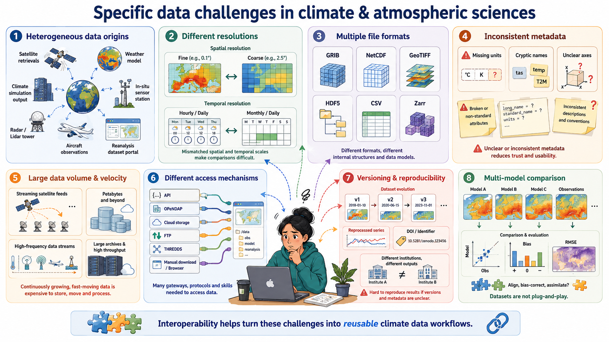

:::::::::::::::::::::::::::::::::::::: questions 

- Why interoperability is important when dealing with research data? 
- What are the three layers of interoperability?
- How can you identify if a dataset is interoperable or not?

::::::::::::::::::::::::::::::::::::::::::::::::

::::::::::::::::::::::::::::::::::::: objectives

- Understand why interoperability matters in climate & atmospheric science
- Recognize the 3 layers: structural, semantic, technical
- Identify interoperable vs non-interoperable datasets

::::::::::::::::::::::::::::::::::::::::::::::::

## What is interoperability?

From the foundational article: *The FAIR Guiding Principles for scientific data management and stewardship* [^1] 

[^1]: [*Wilkinson, M. D., Dumontier, M., Aalbersberg, I. J., Appleton, G., Axton, M., Baak, A., ... & Mons, B. (2016). The FAIR Guiding Principles for scientific data management and stewardship. Scientific data, 3(1), 1-9.*](https://www.nature.com/articles/sdata201618)

Three guiding principles for interoperability are:
 
 - I1. (meta)data use a formal, accessible, shared, and broadly applicable language for knowledge representation.
 -  I2. (meta)data use vocabularies that follow FAIR principles
 -  I3. (meta)data include qualified references to other (meta)data

:::::::::: instructor

It might be a good time to survey the participants to see how many of them have: 

- heard of NetCDF format before (*n.b.*, it's a prerequisite of the workshop)

- have experience working with NetCDF format. 

:::::::::::::::::::::::::

::::::::::::::::::::::::::: challenge

### Assessing how interoperable a dataset is

You receive a dataset containing global precipitation estimates for 2010–2020. Its characteristics are:

- Provided as an NetCDF file.
- Variables have short, cryptic names (e.g., `prcp`, `lat`, `lon`).
- Metadata uses inconsistent units (some missing).
- Coordinates and grids are documented only in an accompanying PDF.
- The dataset includes a persistent identifier ([DOI](https://www.doi.org/)) and references two external datasets used for validation. 
- No controlled vocabularies or community standards (e.g., [CF](https://cf-convention.github.io/), [GCMD](https://www.earthdata.nasa.gov/data/tools/gcmd-keyword-viewer) keywords) are used.

Based on the FAIR interoperability principles (I1–I3), how would you rate the interoperability of this dataset?

A) High interoperability — it uses a widely supported file format and includes references to other datasets.
B) Moderate interoperability — some technical elements exist, but semantic clarity and formal vocabularies are missing.
C) Low interoperability — metadata and semantic descriptions do not meet I1–I3 requirements.
D) Full interoperability — all three interoperability principles (I1, I2, I3) are clearly satisfied.

:::::::::solution

### Solution

Correct answer: B or C depending on the level of strictness, but for educational clarity, choose C.

I1: Not satisfied (no formal/shared language for knowledge representation; heavy reliance on PDF documentation).

I2: Not satisfied (no controlled vocabularies, no standards).

I3: Partially satisfied (qualified references exist, but insufficient context).
=> Overall, interoperability is low.

:::::::::::::::::

:::::::::::::::::::::::::::::::::::::::

## Identify the three layers of interoperability

These are properties that datasets must fulfill to enable interoperability with the wider research ecosystem, including APIs, notebooks, online viewers, and other tools.

### Structural interoperability = representation

Structural interoperability ensures that data is organized, stored, and encoded in predictable, machine-actionable ways. This is achieved through:

- common file formats

- shared data models

- consistent dimension and array structures

Examples include [NetCDF](https://www.unidata.ucar.edu/software/netcdf), [Zarr](https://zarr.dev/), and [Parquet](https://parquet.apache.org/), which define how variables, coordinates, and metadata are stored. Structural interoperability allows tools across programming languages and platforms to read data consistently.

### Semantic interoperability = meaning

Semantic interoperability ensures that data carries shared, consistent meaning across institutions and tools.
This is achieved through:

- standard vocabularies
- controlled terms
- variable naming conventions 
- units
- coordinate definitions

Examples include Climate and Forecast ([CF](https://cf-convention.github.io/))  standard names, attributes, and controlled vocabularies. Without semantic interoperability, datasets cannot be reliably interpreted, compared, or combined.

### Technical interoperability = access

Technical interoperability ensures that data can be accessed, exchanged, and queried using standard, machine-readable mechanisms. This is achieved through:

- APIs

- remote access protocols

- web services

- cloud object storage interfaces

Examples include [OPeNDAP](https://www.opendap.org/), [THREDDS](https://www.unidata.ucar.edu/software/tds) and REST APIs. Technical interoperability enables automated workflows, cloud computing, and scalable analytics.

### References

- European Commission (Ed.). (2004). European interoperability framework for pan-European egovernment services. Publications Office.
- European Commission. Directorate General for Research and Innovation. & EOSC Executive Board. (2021). EOSC interoperability framework: Report from the EOSC Executive Board Working Groups FAIR and Architecture. Publications Office. https://data.europa.eu/doi/10.2777/620649

::::::::::::::::::::::::::: challenge

### Reflect back on the three guiding principles for interoperability (I1–I3)(Think-Pair-Discuss):

 - I1. (meta)data use a formal, accessible, shared, and broadly applicable language for knowledge representation.
 -  I2. (meta)data use vocabularies that follow FAIR principles
 -  I3. (meta)data include qualified references to other (meta)data

Do they represent all the three layers of interoperability (structural, semantic, technical)? Explain your reasoning.

:::::::::solution

### Solution

FAIR’s interoperability principles emphasize semantic interoperability, addressed by controlled vocabularies and naming conventions, while structural and technical layers are insufficiently addressed.

For a domain like climate science, structural interoperability achieved by common data models and file formats (e.g. NetCDF files) as well as technical interoperability facilitated by machine-readable mechanisms (e.g.OPeNDAP protocol) matter enormously. 
For this, FAIR's three guiding principles alone is not enough to guarantee practical interoperability.

:::::::::::::::::

:::::::::::::::::::::::::::::::::::::::

::::::::::::::::::::::::::: challenge

### True/False or Agree/Disagree with discussion afterwards 

- “As long as data are open access, they are interoperable.”
- “Metadata standards help ensure interoperability.”
- “As long as data is using an open standard format is interoperable” 

:::::::::solution

### Solution

F,T,F

:::::::::::::::::

:::::::::: instructor

This exercise is for discussion in Plenum nad it can serves as a good link to the next section

:::::::::::::::::::::

:::::::::::::::::::::::::::::::::::::::

## Why to bother to make datasets interoperable?

Interoperability is key in research, specially in climate and atmospheric sciences, because researchers routinely work with multiple heterogeneous datasets that were never originally designed to work together. By ensuring that data are described consistently, stored in predictable structures, and accessed through standard mechanisms, interoperability makes it possible to combine and reuse data efficiently across research workflows.

First, **interoperability enables data reuse**: when datasets follow shared metadata conventions and formats, researchers can easily understand what variables represent, how they were produced, and how they can be used in new contexts. This avoids redundant effort and saves time across research groups.

Second, **interoperability enables integration across sources, for example**, combining model output with satellite observations, radar measurements, in-situ sensors, and reanalysis datasets. These data sources differ in resolution, structure, access method, and semantics; without shared standards, aligning them becomes difficult or impossible.

Third, **interoperability reduces friction in data pipelines**. Standardized formats, consistent metadata, and machine-actionable APIs allow workflows to run smoothly without manual cleaning, renaming, or restructuring. This is especially critical when handling large, frequently updated datasets typical in climate research.

Finally, **interoperability is required for automation, AI, dashboards, and multi-disciplinary science**. Machine learning pipelines, automated monitoring systems, and interactive applications rely on consistent, accessible, and machine-readable data. Without interoperability, these tools break or require extensive custom engineering.

In short, interoperability is what makes the diverse, high-volume data ecosystem of climate and atmospheric science usable, scalable, and scientifically trustworthy.

## Key elements of interoperable research workflows

Interoperable research workflows rely on a set of shared practices, formats, and technologies that allow data to be exchanged, understood, and reused consistently across tools and institutions. In climate and atmospheric science, these elements form the backbone of scalable, reproducible, and machine-actionable data ecosystems.

- Community formats (NetCDF, Zarr, Parquet) provide a common structural foundation.

    These formats encode data in predictable ways, with clear rules about dimensions, variables, and internal structure. NetCDF remains the dominant community standard for multidimensional geoscience data, while Zarr offers a cloud-native representation suitable for large-scale, distributed computing. Parquet complements both by providing an efficient columnar format for tabular or metadata-rich data. Using community formats ensures that tools across languages and platforms can interpret datasets consistently.

- Standardized metadata ([CF](https://cf-convention.github.io/) conventions) provide the semantic layer needed for meaningful interpretation.

    CF conventions define variable names, units, coordinate systems, and grid attributes so that datasets from different sources “speak the same language.” This allows climate model output, satellite observations, and reanalysis products to be aligned and compared reliably.

- Stable APIs enable technical interoperability by providing machine-readable access to data and metadata.

    APIs based on HTTP and JSON allow automated workflows, programmatic data publication, and integration between repositories, processing systems, and analysis tools. A stable, well-documented API ensures that downstream services and scripts continue to function even as data collections evolve.

- Cloud-native layouts make large datasets scalable and performant.

    By storing data as independent chunks in object storage, formats such as Zarr allow parallel, lazy, and distributed access, ideal for big climate datasets, serverless workflows, and AI pipelines. This ensures that even multi-terabyte archives can be streamed efficiently without requiring full downloads.

Together, these elements work as a coordinated system: community formats provide structure, metadata provides meaning, APIs provide access, and cloud-native layouts provide scalability.

::::::::::::::::::::::::::: challenge

### Real world barriers to data interoperability and reuse (Think-Pair-Discuss)

Think of a time when you tried to reuse a dataset that you did not produce. (5 minutes)
What was the most significant barrier you encountered?

Pair discussion (5 minutes)

Share your experiences with your partner:

- What specific interoperability challenges did you face (structural, semantic, technical)?

- How did you try to overcome them?

- Would adherence to FAIR I1–I3 principles have helped? If so, how?

Group debrief (5 minutes)

Discuss as a group:

- Common obstacles

- Whether these were structural, semantic, or technical

- How such challenges could be prevented if data producers had designed the dataset with interoperability in mind (e.g., CF conventions, persistent identifiers, shared vocabularies, formal metadata languages)

:::::::::: instructor

Examples of barriers to reuse datasets might include:

- Missing metadata

- Non-standard units or unclear variable names

- File formats you could not easily open
- Access restrictions or unstable URLs

- Large data volumes and inefficient download workflows

- Difficulty aligning datasets from multiple institutions
- Lack of documentation on coordinate systems or time conventions

- Inconsistent versions or unclear provenance

This discussion sets up the motivation for the rest of the workshop: practical, hands-on methods to make interoperable data using real tools such as NetCDF, CF conventions, and [OPeNDAP](https://www.opendap.org/).

:::::::::::::::::::::::::

:::::::::::::::::::::::::::::::::::::::

## Specific data challenges in the climate & atmospheric sciences

- **Heterogeneous data origins:** Climate research integrates satellite retrievals, weather models, climate simulations, in-situ sensors, radar, lidar, aircraft measurements, and reanalysis datasets—each with its own structure, conventions, and processing workflows.

- **Different spatial and temporal resolutions**: Satellite images may be daily or hourly at 1 km resolution, while climate models may provide monthly or daily outputs on coarse grids; combining them requires consistent metadata and alignment.

- **Multiple file formats and data models**: Data may come as GRIB, NetCDF, GeoTIFF, HDF5, CSV, or Zarr, each with different structural assumptions that affect processing and interpretation.

- **Inconsistent metadata quality**: Missing units, inconsistent variable names, unclear coordinate systems, or non-standard attributes are frequent issues—making semantic interoperability a major challenge.

- **Large data volume and velocity**: Earth observation missions (e.g., Sentinel, GOES), reanalysis products (ERA5), and high-resolution climate simulations produce terabytes to petabytes of data, making efficient, interoperable access necessary.

- **Different access mechanisms and services**: Data are distributed across portals using APIs, OPeNDAP servers, cloud object storage, FTP, THREDDS catalogs, proprietary download tools, or manual interfaces, requiring technical interoperability to automate workflows.

- **Versioning and reproducibility issues**: Climate datasets evolve frequently (e.g., reprocessed satellite series, new CMIP6 versions), and without stable identifiers or catalog metadata, reproducibility becomes difficult across institutions.

- **Need for multi-model and multi-dataset comparisons**: Studies such as model evaluation, bias correction, and data assimilation depend on aligning diverse datasets that were never originally designed to work together.

::::::::::::::::::::::::::: challenge

### Discuss with you peer: 

Participants inspect a small dataset and answer:

    • What is its structure?

    • What metadata does it have?

    • How is it accessed?

- dataset 1: https://opendap.4tu.nl/thredds/dodsC/IDRA/2019/01/02/IDRA_2019-01-02_quicklook.nc.html
- dataset 2: https://swcarpentry.github.io/python-novice-inflammation/data/python-novice-inflammation-data.zip
- dataset 3: https://opendap.4tu.nl/thredds/dodsC/data2/uuid/9604a1b0-13b6-4f23-bd6c-bb028591307c/wind-2003.nc.html 

:::::::::solution

### Solution

Participants should identify whether the dataset is interoperable based on the three layers discussed (structural, semantic, technical).

dataset 1: Interoperable

- Structure: NetCDF format with clear dimensions and variables.
- Metadata: CF-compliant attributes, standard names, units.
- Access: OPeNDAP protocol for remote access.

dataset 2: Not interoperable

- Structure: CSV files with ambiguous column headers.
- Metadata: Lacks standardized metadata, unclear variable meanings.
- Access: Manual download, no API or remote access.

dataset 3: Not interoperable

- Structure: NetCDF format but missing CF compliance.
- Metadata: Inconsistent or missing units, unclear variable names.
- Access: OPeNDAP protocol

:::::::::::::::::

:::::::::::::::::::::::::::::::::::::::

::::::::::::::::::::::::::::: keypoints

- Interoperability ensures that data can be understood, combined, accessed, and reused across tools, institutions, and workflows with minimal manual intervention.

- Interoperability operates at three complementary layers:structural (how data is encoded and organized),semantic (how data is described and interpreted), and
technical (how data is accessed and exchanged).

- The FAIR interoperability principles I1–I3 primarily address the semantic layer. They provide essential guidance on shared metadata languages, vocabularies, and references, but they do not fully cover structural and technical interoperability.

- In climate and atmospheric science, all three layers are required for practical reuse. Structural standards (e.g., NetCDF, Zarr), semantic conventions (e.g., CF), and technical mechanisms (e.g., APIs, OPeNDAP, THREDDS) must work together.

- Many real-world barriers to reuse datasets (unclear metadata, missing units, inconsistent coordinate systems, incompatible file formats, unstable access mechanisms) are failures of one or more interoperability layers.

- Interoperable research workflows rely on established community formats, standardized metadata conventions, stable access protocols, and scalable cloud-native layouts that allow large heterogeneous datasets to be aligned, streamed, and analysed consistently.

- Interoperability is essential in climate science because datasets come from diverse sources (models, satellites, sensors, reanalysis) and must be combined into integrated analyses that are reproducible and machine-actionable.

:::::::::::::::::::::::::::::::
