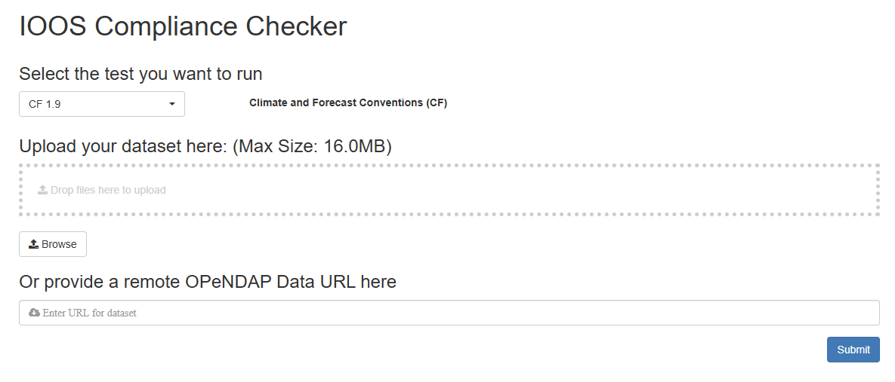

:::::::::::::::::::::::::::::::::::::: questions 

- What does semantic interoperability mean in the context of scientific data?

- Why is structural interoperability alone insufficient for meaningful data reuse?

- How do community metadata conventions (e.g. CF) encode shared scientific meaning?

- What does it mean for a NetCDF file to be “CF-compliant”?

::::::::::::::::::::::::::::::::::::::::::::::::

::::::::::::::::::::::::::::::::::::: objectives

By the end of this episode, learners will be able to: 

- Distinguish  between structural and semantic interoperability.

- Explain why shared vocabularies and conventions are required for machine-actionable meaning.

- Describe the role of the CF Conventions in climate and atmospheric sciences.

Recognize common semantic interoperability issues in NetCDF datasets.

::::::::::::::::::::::::::::::::::::::::::::::::

## What is semantic interoperability?

Semantic interoperability concerns shared meaning.

A dataset is semantically interoperable when machines and humans interpret its variables in the same scientific way, without relying on informal documentation, personal knowledge, or context outside the data itself. Semantic interoperability answers the question:

**“Do we agree on what this data represents?”**

This goes beyond structure. Two datasets may both contain a variable named `temp`, stored as a float array over time and space, yet represent:

- air temperature at 2 m

- sea surface temperature

- model potential temperature

- sensor voltage converted to temperature

**Are these the same quantity?** No.

Without semantic constraints, machines cannot reliably compare, combine, or reuse such data.

## Why structural interoperability is not enough

Structural interoperability ensures that:

- dimensions are explicit,

- arrays align,

- metadata is machine-readable.

However, structure does not define meaning.

Example:

A NetCDF file may be perfectly readable by xarray. Variables may have dimensions (`time`, `lat`, `lon`).

Units may be present. Yet machines still cannot know: what physical quantity is represented, at which reference height or depth, whether values are comparable across datasets.

This gap is addressed by semantic conventions, not file formats.

## Semantic interoperability via CF Conventions

The [Climate and Forecast (CF) Conventions](https://cfconventions.org/) define a shared semantic layer on top of NetCDF’s structural model.

CF specifies, among others:

- Standard names: Controlled vocabulary linking variables to formally defined physical quantities (e.g. `air_temperature`, `sea_surface_temperature`)

- Units: Enforced through UDUNITS-compatible expressions

- Coordinate semantics: Meaning of vertical coordinates, bounds, and reference systems

- Grid mappings and projections: Explicit spatial reference information

- Relationships between variables: For example, how bounds, auxiliary coordinates, or cell methods relate to data variables

By adhering to CF, datasets become semantically interoperable:

- A NetCDF file without CF can be structurally interoperable, but it is semantically ambiguous.

- A NetCDF file with CF becomes interpretable across tools, domains, and time.

## Community governance and ecosystem alignment

Semantic interoperability is not achieved by individual researchers alone.

CF Conventions are:

- Developed and maintained by a broad scientific community

- Reviewed, versioned, and openly governed

- Adopted by major infrastructures and workflows

This shared semantic contract enables: Cross-dataset comparison, automated discovery and filtering and large-scale synthesis and reuse. 

::::::::::::::::::::::: challenge

## Semantic interoperability . True or False?

Indicate whether each statement is True or False, and justify your answer.

1. A NetCDF file with dimensions, variables, and units is semantically interoperable by default.

2. CF standard names allow machines to distinguish between different kinds of “temperature”.

3. Semantic interoperability mainly benefits human readers, not automated workflows.

4. Two datasets using the same CF standard name can be compared without manual interpretation.

5. Semantic interoperability can be achieved without community-agreed conventions.

:::::::::::::::::::::::::::::::::::::::::::::: solution

1. False. Structure alone does not define meaning; semantics require controlled vocabularies and conventions.

2. True . CF standard names explicitly encode physical meaning, not just labels.

3. False. Semantic interoperability is essential for automated discovery, comparison, and integration.

4. True . Shared semantics enable machine-actionable comparability (subject to resolution and context).

5. False. Semantic interoperability depends on community agreement, not individual interpretation.

:::::::::::::::::::::::::::::::::::::::::::::::::::::::
:::::::::::::::::::::::::::::::::

## CF compliance

A NetCDF file is considered **CF-compliant** when it adheres to the rules and conventions defined by the CF standard.

The tool [IOOS Compliance Checker](https://compliance.ioos.us/index.html) is a web application that evaluates NetCDF files against CF Conventions based on Python. Its source code is available on [GitHub](https://github.com/ioos/compliance-checker).

### Try the Compliance Checker

1. Go to the [IOOS Compliance Checker](https://compliance.ioos.us/index.html).
    - Explore the interface and options.

    

2. Provide a valid remote OPenNDAP url 
    - A valid url (endpoint to the dataset, not a html page) : `https://opendap.4tu.nl/hredds/dodsC/` + `IDRA/year/month/day/filename.nc`
    - For example, use this sample dataset: `https://opendap.4tu.nl/thredds/dodsC/IDRA/2009/04/27/IDRA_2009-04-27_06-08_raw_data.nc`
    - Wrong url (html page): `https://opendap.4tu.nl/thredds/catalog/IDRA/2009/04/27/catalog.html?dataset=IDRA_scan/2009/04/27/IDRA_2009-04-27_06-08_raw_data.nc`

3. Click on **Submit**.

4. Review and download the report

:::::::::: keypoints

- Semantic interoperability ensures that data variables have shared, machine-actionable scientific meaning, not just readable structure.

- Structural interoperability is necessary but insufficient for reliable comparison and reuse across datasets.

- The CF Conventions provide a community-governed semantic layer on top of NetCDF through standard names, units, and coordinate semantics.

- CF compliance enables automated discovery, comparison, and integration in climate and atmospheric science workflows.

- Semantic interoperability depends on community-agreed conventions, not on file formats or variable names alone.

::::::::::