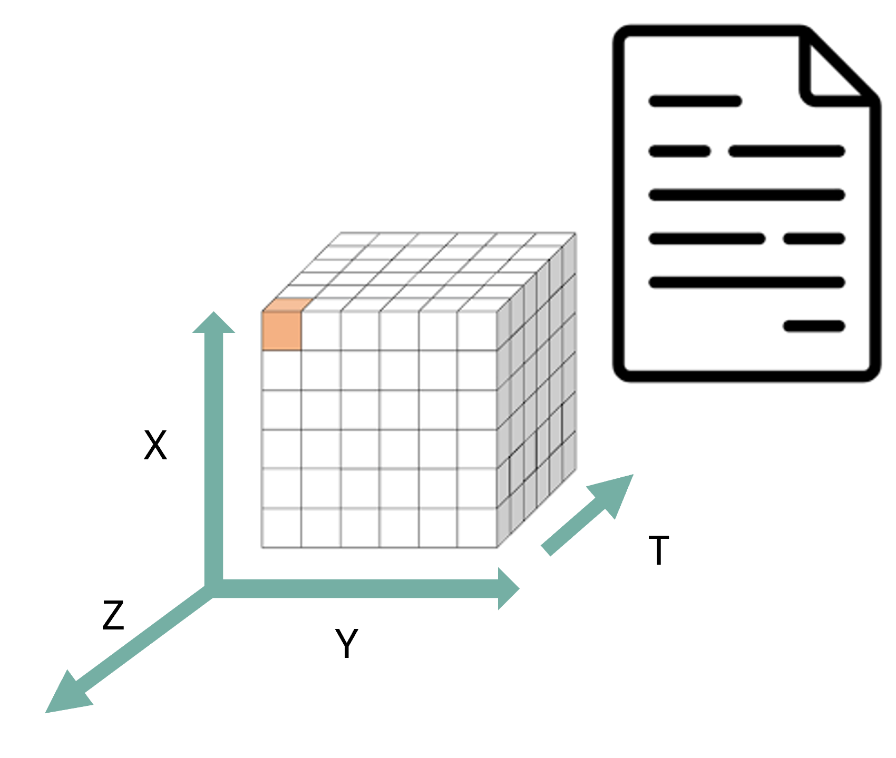

:::::::::::::::::::::::::::::::::::::: questions

* What is structural interoperability, and what does it allow software to do?
* How do data models, file formats, schemas, conventions, and access methods differ?
* How can simple tabular formats such as CSV and TSV support reusable, machine-actionable data?
* Which structural standards are appropriate for common climate and atmospheric data types?
* What structural contract does the NetCDF data model provide?

::::::::::::::::::::::::::::::::::::::::::::::::

::::::::::::::::::::::::::::::::::::: objectives

* Explain structural interoperability as a shared, machine-actionable agreement about how data elements are organised and related.
* Distinguish between a **data model**, **encoding or file format**, **schema**, **community convention**, and **access method**.
* Evaluate the structural strengths and limitations of CSV/TSV, Parquet, NetCDF, Zarr, GRIB, and GeoTIFF.
* Identify the additional information needed to make tabular data reliably reusable across tools.
* Analyse a NetCDF dataset by identifying its dimensions, coordinate variables, data variables, attributes, and data types.

::::::::::::::::::::::::::::::::::::::::::::::::

## What is structural interoperability?

Structural interoperability concerns the **organisation and representation of data**: what kinds of data objects exist, how they are encoded, and how their relationships are expressed.

A dataset is structurally interoperable when different software tools can reliably:

* open and parse it using a published specification;
* locate records, columns, arrays, variables, coordinates, and metadata;
* determine data types, shapes, dimensions, and relationships;
* distinguish data values from missing or fill values;
* validate the dataset against explicit rules; and
* transform or subset it without relying on undocumented, dataset-specific assumptions.

A useful guiding question is: **Can another tool determine how the dataset is organised and process that organisation without bespoke instructions from the person who created it?**

This does **not** mean that a machine automatically understands the scientific meaning of every value. Structural interoperability makes the organisation machine-actionable; semantic interoperability addresses whether terms such as `precipitation_flux`, `rainfall_rate`, or `DBZH` are defined and interpreted consistently.

## Structural interoperability is a contract, not a file extension

A file extension such as `.csv`, `.nc`, `.tif`, or `.zarr` is only a label. Structural interoperability depends on several related layers working together.

| Layer | Question answered | Example |
|---|---|---|
| **Data model** | What kinds of objects exist, and how are they related? | Rows, columns, and cells; or dimensions, arrays, coordinates, and attributes |
| **Encoding or format** | How is that model represented as text or bytes? | Comma-delimited text, NetCDF binary encoding, Parquet column chunks |
| **Schema** | Which fields or variables are expected, with which types and constraints? | `station_id` is a required string; `temperature` is a number |
| **Convention or profile** | How should a community use the model and metadata consistently? | CF Conventions for NetCDF; CSVW metadata; Cloud Optimized GeoTIFF |
| **Access method** | How are the bytes or logical data objects retrieved? | Local file access, HTTP, OPeNDAP, object storage, HTTP range requests |

These layers should not be treated as synonyms.

* **NetCDF** defines a data model and one or more encodings.
* **CF Conventions** add rules for describing scientific variables, coordinates, units, and grid mappings within that model (see [Semantic interoperability episode](semantic-interoperability.md))
* **OPeNDAP** is an access protocol that exposes remotely stored data for subsetting and retrieval.(see [Technical interoperability: Data access protocols episode](protocols.md))

Similarly, a CSV file defines a simple textual representation, but its structure becomes more reliable when a schema describes the columns, types, constraints, missing values, and dialect.

::::::::::::::::::::::::::::::::::::: callout

### A useful test: can the structure be validated?

A structurally interoperable dataset should have enough explicit rules for a validator or reader to detect problems such as:

* a missing required column;
* a value with the wrong data type;
* an array whose dimensions do not match its declared shape;
* an undefined coordinate variable;
* an invalid fill value;
* inconsistent chunk metadata; or
* missing georeferencing information.

If correct interpretation depends mainly on a README, an email, or knowledge held by the original researcher, the structural contract is incomplete.

:::::::::::::::::::::::::::::::::::::

## Structural interoperability is about data models, not only formats

A **data model** defines the logical structure that software works with. Different scientific data types require different models.

### Tabular model

A table consists of rows, columns, and cells. Each row normally represents one observation or entity, and each column represents one property.

Suitable formats include:

* CSV and TSV for simple, portable tables;
* Parquet for typed, column-oriented analytical tables; and
* GeoPackage for standards-based geospatial tables, vector features, and tiles.

### Multidimensional array model

A multidimensional dataset consists of arrays whose axes may represent time, latitude, longitude, height, range, ensemble member, or another dimension.

Suitable formats include:

* NetCDF for self-describing array-oriented scientific datasets;
* Zarr for chunked arrays stored across filesystems or object storage; and
* GRIB for highly standardised operational meteorological fields.

### Raster model

A raster represents values on a regular grid of pixels or cells. Geospatial rasters also need a defined relationship between the grid and a coordinate reference system.

Suitable formats include:

* GeoTIFF for georeferenced raster data; and
* Cloud Optimized GeoTIFF (COG), which adds layout requirements that support efficient partial access over HTTP.

Choosing a widely recognised format that matches the underlying data model allows existing tools to reuse the data with fewer transformations. Converting a multidimensional climate cube into a flat CSV may technically preserve values, but it discards or obscures relationships among dimensions, coordinates, and variables. Conversely, storing a small two-column lookup table in NetCDF may add unnecessary complexity.

## CSV and TSV: portable, but not automatically self-describing

CSV and TSV are important interoperability formats because they are plain text and are supported by spreadsheets, databases, statistical packages, command-line tools, and most programming languages. [RFC 4180](https://www.rfc-editor.org/info/rfc4180/) documents a commonly used CSV syntax and the `text/csv` media type, but it does not define a complete type system, scientific metadata model, or table schema.

For example:

```text
station_id,timestamp,air_temperature
NL001,2026-07-13T12:00:00Z,18.4
NL001,2026-07-13T13:00:00Z,18.8
```

Most tools can recognise this as a table. However, the file alone may not tell a reader:

* whether the delimiter is a comma, semicolon, or tab;
* which character encoding is used;
* whether the first row is a header;
* whether decimal commas or decimal points are used;
* whether `timestamp` is UTC and which date-time syntax it follows;
* whether `air_temperature` is text, an integer, or a floating-point number;
* which unit is used;
* whether an empty cell, `NA`, `-999`, or another token represents missing data;
* whether `station_id` must be unique or refer to another table; or
* whether each row represents one observation, one station, or one summary period.

CSV therefore provides **syntactic portability**, but only a limited structural contract. Structural interoperability improves when the producer also provides:

* a fixed and documented dialect: delimiter, quote character, encoding, decimal mark, and line endings;
* a single header row with stable, machine-friendly column names;
* consistent numbers of fields in every row;
* explicit data types and constraints;
* an unambiguous missing-value policy;
* standard date and time representations;
* stable identifiers and declared relationships between tables; and
* a machine-readable schema, for example using [W3C CSV on the Web](https://www.w3.org/TR/tabular-data-model/) or a [Frictionless Table Schema](https://specs.frictionlessdata.io/table-schema/).

TSV uses a tab as the delimiter but has the same fundamental strengths and limitations. The delimiter changes; the underlying tabular data model does not.

::::::::::::::::::::::::::::::::::::: instructor

### Important teaching distinction

Avoid saying that CSV is "not interoperable." CSV is one of the most widely exchangeable formats available. Its limitation is that it is **weakly typed and weakly self-describing**. A well-designed CSV accompanied by a machine-readable schema can be more reusable than a poorly structured file in a richer binary format.

:::::::::::::::::::::::::::::::::::::


## Comparing structural formats for different data types

| Format or standard | Primary data model | Structural strengths | Important limitation or additional requirement |
|---|---|---|---|
| **CSV / TSV** | Rows, columns, cells | Human-readable, simple, broadly supported | Types, missing values, units, dialect, and relationships are usually not encoded unless a schema or profile is supplied |
| **Parquet** | Typed, column-oriented tables, including nested fields | Stores a schema and physical types; supports efficient column selection, filtering, encoding, and compression | Scientific meaning, units, coordinate reference systems, and domain constraints still need metadata conventions |
| **NetCDF** | Named multidimensional variables, dimensions, and attributes | Self-describing array structure; variables can share dimensions; broad scientific tooling | NetCDF alone does not ensure consistent scientific meaning or coordinate conventions; CF or another convention is often needed |
| **Zarr** | Hierarchies of chunked, typed N-dimensional arrays and groups | Explicit shape, type, fill value, chunk grid, codecs, and storage-independent access | Core metadata permits flexible user attributes; dimension naming and scientific coordinate relationships still require conventions and application agreements |
| **GRIB2** | Message-oriented gridded meteorological fields | Strict templates and WMO code tables enable operational exchange among meteorological systems | Highly specialised and less convenient for arbitrary research metadata or multi-variable exploratory datasets |
| **GeoTIFF** | Georeferenced raster grid | Encodes raster organisation and georeferencing in a standard TIFF structure | Metadata beyond raster and georeferencing may require additional conventions or sidecar information |
| **COG** | GeoTIFF plus an access-oriented layout profile | Enables efficient partial reads over HTTP using internal tiling, overviews, and byte-range requests | It is a profile of GeoTIFF, not a substitute for meaningful scientific metadata |
| **GeoPackage** | Standardised SQLite tables for vector features, tiles, rasters, and metadata | Defines required tables, integrity constraints, coordinate reference system tables, and extension rules | Best suited to geospatial features and tiles rather than large multidimensional climate arrays |

::::::::::::::::::::::::::::::::::::: callout

### A richer container is not automatically more interoperable

HDF5 can represent highly complex hierarchies, arrays, and metadata, but it permits many possible organisational patterns. Two HDF5 files can therefore use entirely different internal structures.

NetCDF-4 uses HDF5 as an underlying storage technology but constrains it through the NetCDF enhanced data model. This illustrates why a storage container alone is not enough: tools need a shared model and rules for how the container is used.

:::::::::::::::::::::::::::::::::::::

::::::::::::::::::::::::::: challenge

### Which structural contract is missing? (Think-Pair-Discuss)

For each case below, identify what a general-purpose tool can already determine and what additional structural information is needed.

1. `rainfall.csv` contains the columns `station`, `date`, and `value`.
2. `radar.h5` contains several groups and arrays but no published schema or convention.
3. `temperature.nc` contains dimensions, variables, and attributes but does not declare a metadata convention.
4. `satellite.tif` contains image pixels but no coordinate reference system or geotransform.
5. `forecast.zarr` contains chunked arrays with shapes and data types, but the relationships among arrays are not documented.

::::::::::::::::::: solution

### Solution

**1. `rainfall.csv`**

A reader can usually identify rows and columns. It still needs an explicit dialect, data types, date format, units, missing-value rules, and the meaning and uniqueness constraints of `station`. A CSVW or Frictionless schema could provide much of this information.

**2. `radar.h5`**

The HDF5 library can inspect groups, datasets, shapes, and stored attributes. It cannot assume what those objects represent or how they relate. A shared application schema, convention, or data model is needed.

**3. `temperature.nc`**

A NetCDF reader can determine variables, dimensions, shapes, types, and attributes. It may still be unable to identify latitude, longitude, time, vertical coordinates, grid mappings, or standard scientific quantities reliably. Declaring and following CF Conventions would strengthen interoperability.

**4. `satellite.tif`**

An image reader can decode the pixel grid, but a geospatial tool cannot place it correctly on Earth without georeferencing. GeoTIFF tags should declare the coordinate reference system and the transformation from pixel coordinates to geographic or projected coordinates.

**5. `forecast.zarr`**

A Zarr implementation can find arrays, decode chunks, and determine shape and data type. An application-level convention is still needed to identify coordinate arrays, shared dimensions, scientific variables, units, and grid mappings consistently.


:::::::::::::::::::::::::::::::::::::::


:::::::::::::::::::::::::::::::::::::::::::::::::::::::


## NetCDF: a data model for multidimensional scientific data

[NetCDF](https://docs.unidata.ucar.edu/nug/current/) is a family of data formats and software libraries built around a shared model for array-oriented scientific data.

The classic NetCDF data model contains three central elements:

* **Dimensions** are named axes with a length, such as `time`, `latitude`, `longitude`, `height`, or `range`.
* **Variables** are typed N-dimensional arrays whose shapes are defined by one or more dimensions.
* **Attributes** are small metadata values attached either to a variable or to the dataset as a whole.

The enhanced NetCDF-4 data model adds groups, additional data types, multiple unlimited dimensions, and user-defined types.



### What NetCDF makes machine-actionable

A NetCDF reader can inspect:

* the names and lengths of dimensions;
* the names, data types, and shapes of variables;
* which dimensions are shared by multiple variables;
* variable-level and global attributes;
* fill values and storage encodings; and
* in NetCDF-4, groups and chunking information.

For example, the declaration

```text
float air_temperature(time, latitude, longitude)
```

states that `air_temperature` is a three-dimensional floating-point array and that its axes are related to the dimensions `time`, `latitude`, and `longitude`.

### What NetCDF does not guarantee by itself

NetCDF permits attributes to be added, but it does not require every producer to use the same names or scientific conventions. A file can be valid NetCDF while still using:

* ambiguous variable names;
* missing or non-standard units;
* unclear coordinate relationships;
* undocumented grid mappings; or
* inconsistent missing-value practices.

For climate and atmospheric data, [CF Conventions](https://cfconventions.org/cf-conventions/cf-conventions.html) define additional rules for identifying coordinate variables, auxiliary coordinates, standard names, units, grid mappings, cell bounds, and other scientific metadata.

Therefore:

> **NetCDF provides the structural container and core array data model; CF provides a more specific community contract for using that structure.**

## Other structural standards in climate and atmospheric workflows

### Zarr: chunked arrays across storage systems

[Zarr](https://zarr.dev/) represents arrays and groups in a hierarchy. Its metadata describes array shape, data type, fill value, chunk grid, chunk-key encoding, and codecs. The chunks and metadata can be stored in a local directory, an object store, or another key-value store.

This supports:

* independent retrieval of chunks;
* lazy and parallel computation;
* cloud and distributed storage; and
* access without downloading an entire dataset.

Zarr provides a strong storage-level structural contract. However, arbitrary user attributes are allowed, and dimension names may be omitted. Climate workflows therefore still depend on conventions used by libraries such as xarray and, where appropriate, CF-compatible metadata practices.

### Parquet: typed, column-oriented tables

[Apache Parquet](https://parquet.apache.org/) is designed for efficient storage and retrieval of tabular and nested data. It records a schema and physical data types, stores values by column, and supports compression and selective reads.

It is well suited to:

* station observations;
* event and trajectory records;
* large time-series tables;
* metadata catalogues; and
* analytical queries that select a subset of columns or rows.

Parquet provides stronger typing than CSV, but domain metadata such as units, quality flags, controlled variable names, and coordinate reference systems still needs an agreed convention.

### GRIB2: operational meteorological fields

GRIB2 is maintained through the WMO Manual on Codes. It represents gridded meteorological fields using standard message sections, templates, parameters, levels, time-processing information, and code tables.

Its strict structure is valuable for operational exchange because receiving systems can decode forecast and analysis fields using WMO-managed templates and identifiers. The same specialisation can make GRIB less flexible for research datasets that require extensive custom metadata or many related variables in one exploratory dataset.

### GeoTIFF and COG: georeferenced rasters

[GeoTIFF](https://www.ogc.org/standards/geotiff/) defines requirements for storing georeferencing and geocoding information inside TIFF files. This allows GIS and remote-sensing tools to interpret both the pixel grid and its location in a coordinate reference system.

[Cloud Optimized GeoTIFF](https://docs.ogc.org/is/21-026/21-026.html) adds an internal organisation suitable for efficient remote access. Tiling, overviews, and byte ordering allow clients to request only the parts needed for a particular spatial window or resolution.

COG demonstrates that structural interoperability can include not only logical data organisation, but also a standardised physical layout that enables predictable access behaviour.

:::::::::::::::::::: challenge

## Identify the structural elements in a NetCDF dataset

Open the OPeNDAP inspection page for the IDRA dataset:

[IDRA raw data, 2 January 2019](https://opendap.4tu.nl/thredds/dodsC/IDRA/2019/01/02/IDRA_2019-01-02_12-00_raw_data.nc.html)

Identify:

1. the global attributes;
2. the dimensions and their lengths;
3. the coordinate variables;
4. three data variables and their dimensions;
5. the data types of those variables;
6. one variable-level attribute that controls the interpretation of missing data; and
7. any variables that store metadata as data values rather than as global attributes.

:::::::: solution

## Solution

### 1. Global attributes

The dataset-level attributes include:

* `title`
* `institution`
* `history`
* `references`
* `Conventions`
* `location`
* `source`
* `example`

The `Conventions` attribute declares `CF-1.4`. This is a claim that the file follows a specific community convention; conformance should still be checked rather than assumed solely from the declaration.

### 2. Dimensions

The OPeNDAP Data Descriptor Structure shows the following dimensions:

* `time_raw_data = 73728`
* `sample_beat_signal = 1024`
* `time_processed_data = 144`
* `range = 512`
* `scalar = 1`

### 3. Coordinate variables

The variables whose names match their dimensions are:

* `time_raw_data(time_raw_data)`
* `sample_beat_signal(sample_beat_signal)`
* `time_processed_data(time_processed_data)`
* `range(range)`

The `scalar` dimension does not have a variable named `scalar`; it is used as a length-one dimension by several scalar-valued variables.

### 4. Example data variables and dimensions

* `i_hh(time_raw_data, sample_beat_signal)`
* `noise_power_horizontal(range)`
* `equivalent_reflectivity_factor(time_processed_data, range)`
* `radial_velocity(time_processed_data, range)`
* `azimuth_processed_data(time_processed_data)`

### 5. Example data types

* `i_hh` is stored as a 16-bit integer.
* `time_processed_data` is stored as a 64-bit real number.
* `equivalent_reflectivity_factor` is stored as a 32-bit real number.
* `range` is stored as a 32-bit integer.

### 6. Missing-data attribute

Several processed radar variables, including `equivalent_reflectivity_factor`, `differential_reflectivity`, `radial_velocity`, and `spectrum_width`, declare:

```text
_FillValue: -999.0
```

The location and type of `_FillValue` are structural. Whether missing observations should be excluded, interpolated, or interpreted in another way is part of the analytical workflow.

### 7. Metadata stored as variables

The dataset also contains string variables such as:

* `iso_dataset`
* `product`
* `station_details`

These are variables containing structured descriptive text. They should not be confused with the global attributes shown at the top of the OPeNDAP page.

The file is structurally inspectable because software can identify named dimensions, typed variables, shared axes, and attached attributes. However, its usefulness across workflows also depends on how consistently the declared CF convention and variable metadata are applied.

:::::::::::::::::

::::::::::::::::::::::::::::::::::

:::::::::::::::: callout

## Can Ash compare two radar files from different years?

Ash wants to compare two IDRA radar datasets: one from [27 April 2009](https://opendap.4tu.nl/thredds/dodsC/IDRA/2009/04/27/IDRA_2009-04-27_06-08_raw_data.nc.html) and one from [2 January 2019](https://opendap.4tu.nl/thredds/dodsC/IDRA/2019/01/02/IDRA_2019-01-02_12-00_raw_data.nc.html).

Both are NetCDF datasets from the same radar system and are available through OPeNDAP. These shared technologies make them easier to inspect with the same tools, but they do not prove that the files are structurally equivalent.

Ash should compare the following structural properties before combining them:

* variable names and data types;
* dimensions, dimension order, and lengths;
* coordinate variables and coordinate values;
* fill values and missing-data encodings;
* units and scaling attributes;
* declared metadata conventions;
* variables available in one file but absent from the other; and
* whether the same logical quantity is represented by compatible arrays.

For example, two variables can both be named `radial_velocity` but still differ in dimension order, units, fill values, or coordinate grids. Conversely, two structurally compatible variables can use different names and require an explicit renaming step.

This comparison exposes three separate questions:

1. **Technical interoperability:** Can the same tools and protocol open both datasets?
2. **Structural interoperability:** Do the arrays, dimensions, coordinates, types, and metadata locations follow compatible rules?
3. **Semantic interoperability:** Do the variables represent comparable physical quantities, units, reference systems, and measurement procedures?

Structural interoperability reduces the amount of custom code needed to answer these questions, but it does not remove the need for scientific judgement.

:::::::::::::::::::::::::::::::::

:::::::::: keypoints

* Structural interoperability is a shared contract about how data objects are organised, encoded, related, typed, and validated.
* A file extension alone does not provide that contract.
* Data models, encodings, schemas, conventions, and access methods play different roles and should not be treated as synonyms.
* CSV and TSV are broadly portable but weakly self-describing; explicit dialects and machine-readable schemas make them substantially more interoperable.
* The most appropriate structural format depends on the data model: tables, multidimensional arrays, meteorological messages, rasters, or geospatial feature collections.
* Rich containers such as HDF5 do not guarantee interoperability unless communities agree on how their internal structures are used.
* NetCDF provides a shared multidimensional array data model; CF Conventions provide additional rules for climate and forecast metadata.
* Zarr standardises chunked array storage, while additional conventions are still needed to express scientific relationships consistently.
* Open specifications, independent implementations, validation, versioning, and transparent extension rules support long-term interoperability.
* Structural interoperability makes data machine-actionable, but semantic interoperability is still required to determine whether scientific quantities are meaningfully comparable.

::::::::::::::::::::