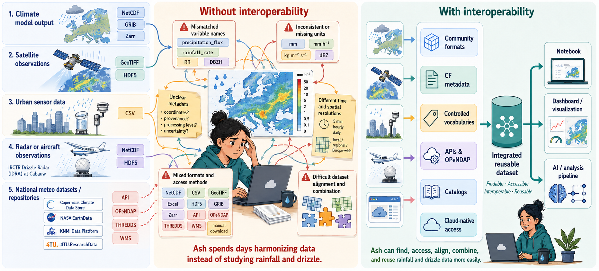

This lesson is about Interoperability in Climate and Atmospheric Sciences. The value of scientific data depends *not only* on its scientific content but on how easily it can be found, accessed, integrated, and reused by others, whether they are human researchers or automated computational workflows.

This course focuses on how to create *first-class* research outputs using the [NetCDF](https://www.unidata.ucar.edu/software/netcdf) format and publishing them through the [4TU.ResearchData](https://data.4tu.nl/) repository. *First class* datasets means 

- easily found through rich, machine-actionable metadata,

- reliably accessed using open standards and stable identifiers,

- seamlessly integrated with other datasets and

- semantically understood by humans and machines

The main message of this lesson is that interoperability is what allows a dataset to connect to the wider research ecosystem. Without it, data remains technically available but difficult to reuse. With it, data can move across tools, repositories, notebooks, dashboards, cloud workflows, and AI pipelines with much less manual repair.
   

## Target audience

This lesson is intended for researchers in the climate and atmospheric sciences who handle multidimensional NetCDF datasets and intend to make their data and software more reusable by others.

## Ash’s challenge: combining climate data for heatwave research

Ash is studying extreme heatwaves in Europe. She wants to compare climate model output with satellite observations, urban sensor measurements, radar or aircraft observations, and datasets deposited in research repositories.

At first, the data ecosystem looks rich. She can search across platforms such as [Copernicus Climate Data Store](https://cds.climate.copernicus.eu/),[NASA EarthData](https://www.earthdata.nasa.gov/), and [4TU.ResearchData](https://data.4tu.nl/). Many datasets are open, downloadable, and described online. But once she begins working with them, the real challenge appears.

The problem is not simply finding data. The problem is making different datasets work together.

Some files are NetCDF, others are CSV, GeoTIFF, Excel, HDF5, or Zarr. Some datasets can be accessed through APIs or OPeNDAP, while others require manual download from a web interface. Some variables have names such as `tas`, `temp`, `air_temperature`, or `T2M`, but it is not always clear whether they represent the same physical quantity. Units may be missing or inconsistent. Coordinates may be stored inside the file, described in a separate PDF, or not documented clearly at all. Some datasets have persistent identifiers and references, while others lack clear provenance or version information.

Ash’s problem is not a lack of data. It is a lack of practical interoperability.

To combine these datasets reliably, Ash needs to answer a sequence of questions:

1. **Can I find the right datasets?**
   Are they described in APIs(Application Programming Interfaces) in a way that supports search by time, location, variable, version, and data type?

2. **Can I read the data structure?**
   Are the files organized using community formats such as NetCDF, Zarr, GeoTIFF, or Parquet, with explicit dimensions, variables, coordinates, and attributes?

3. **Can I understand what the variables mean?**
   Do the datasets use shared metadata conventions, controlled vocabularies, standard names, units, coordinate systems, and provenance information?

4. **Can I access the data programmatically?**
   Can Ash use APIs, [OPeNDAP](https://www.opendap.org/) , [THREDDS](https://www.unidata.ucar.edu/software/tds), or other standard access mechanisms instead of downloading everything manually?

5. **Can I work with the data at scale?**
   Can she subset remote files, read only the variables and time periods she needs, or use cloud-native layouts such as [Zarr](https://zarr-specs.readthedocs.io/en/latest/specs.html) or [Kerchunk](https://fsspec.github.io/kerchunk/) for repeated analysis?

6. **Can I reproduce and automate the workflow?**
   Are dataset versions, identifiers, metadata, and access routes stable enough for notebooks, dashboards, pipelines, or AI(Artifical Intelligence) workflows?

:::::::::: instructor

This lesson follows Ash’s investigation step by step. Learners first diagnose why “open” or “available” data is not automatically interoperable. Then they inspect datasets through the three layers of interoperability:

* **Structural interoperability:** how data is organized, encoded, and made readable by tools.
* **Semantic interoperability:** how variables, units, coordinates, and scientific meaning are made clear and machine-actionable.
* **Technical interoperability:** how data and metadata can be accessed, exchanged, queried, and reused across systems.

::::::::::::::::::::::::::::::::

## Learning objectives 

By the end of this lesson, we aim to equip the learners with: A practical checklist for designing reusable climate and atmospheric datasets from the beginning: use community formats, apply semantic conventions, expose data through stable access mechanisms, and prepare data layouts that can support scalable analysis.

Specifically , learners will learn how to: 

- Assess climate and atmospheric datasets to identify structural, semantic, and technical interoperability barriers that prevent reliable reuse and combination across sources.

- Analyze a NetCDF dataset to identify how its data model, dimensions, variables, coordinates, and attributes enable structural interoperability.

- Evaluate whether a NetCDF dataset provides machine-actionable scientific meaning by examining its use of conventions, standard names, units, and coordinate metadata.

- Use OPeNDAP with Python to access, inspect, subset, and visualize remote NetCDF data while distinguishing metadata retrieval from actual data transfer.

- Use REST API requests to search, retrieve, create, and update repository metadata, explaining how programmatic access supports technical interoperability and reproducible RDM workflows.

- Compare NetCDF, Zarr, and Kerchunk-based access patterns to determine how cloud-native layouts affect structural interoperability, scalability, and efficient reuse of large climate datasets.

- Evaluate the AI-readiness of a climate data infrastructure by linking structural, semantic, and technical interoperability components to scalable, reproducible, and trustworthy machine-learning workflows.

## References and Glossary

For further reading and definitions of key terms introduced in this workshop, consult the [Reference](../learners/reference.md) section. 

:::::: prereq

To follow this lesson, learners should already be able to have :

- Working knowledge in Python (write and execute short scripts in Python)
- Awareness of NetCDF format

:::::::::::::

